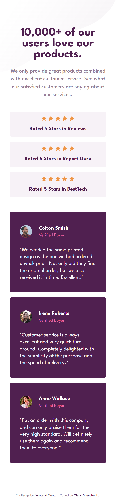
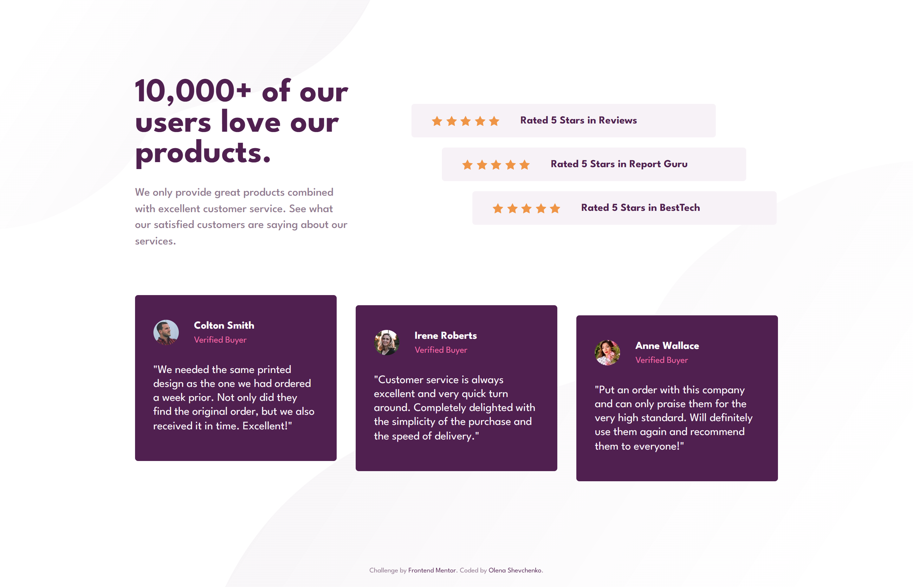

# Frontend Mentor - Social proof section solution

This is a solution to the [Social proof section challenge on Frontend Mentor](https://www.frontendmentor.io/challenges/social-proof-section-6e0qTv_bA). Frontend Mentor challenges help you improve your coding skills by building realistic projects. 

## Table of contents
  - [The challenge](#the-challenge)
  - [Screenshot](#screenshot)
  - [Links](#links)
  - [Built with](#built-with)
  - [Useful resources](#useful-resources)
- [Author](#author)

### The challenge

Users should be able to:

- View the optimal layout for the section depending on their device's screen size

### Screenshot

### Links

- Solution URL: (https://github.com/olenahelena/social__proof__section)
- Live Site URL: (https://curious-nasturtium-b71576.netlify.app/)

### Built with

- Semantic HTML5 markup
- CSS custom properties
- Flexbox
- CSS Grid
- Mobile-first workflow

### Useful resources

- (https://www.w3schools.com/css/css_grid.asp) - This helped me to refresh information about css grid layout.

## Author

- Website - (https://github.com/olenahelena/social__proof__section)
- Frontend Mentor - [@olenahelena](https://www.frontendmentor.io/profile/olenahelena)
